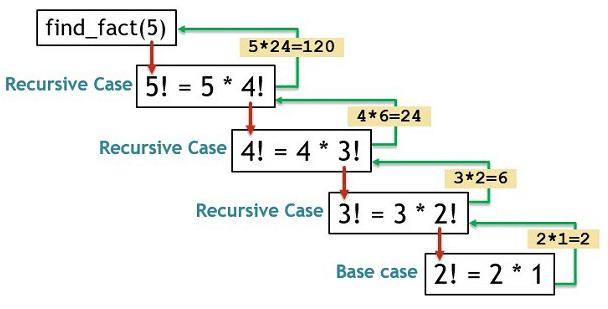

# Funciones
## Declarar y definir una función
- Declarar: Significa anunciar que existe
    - Se usa la palabra clave `def` seguida por el **nombre** de la función, **paréntesis** y **dos puntos**.
- Definir: Implica escribir qué acciones realizará
    - Importante indentar el bloque de código.

**Ejemplo:**
```python
def saludar():          #Declaración
    print("¡Hola!")     #Definición
```

## Llamar a una función
Se hace escribiendo el **nombre** de la función seguido de **paréntesis**.

**Ejemplo:**
```python
def saludar():          #Declaración
    print("¡Hola!")     #Definición

saludar() #Llamado a la función saludar
```
**Salida esperada:**
```plaintext
¡Hola!
```

## Parámetros y argumentos una función
- Parámetros: Variables de entrada de una función.
- Argumentos: Valores pasados como parámetros a una función.

**Ejemplo:**
```python
def saludar(nombre, numero):                #Parámetros: nombre, numero
    print(f"Hola {nombre}, N: {numero}")

saludar(Ana, 10)        #Argumentos: nombre=Ana, numero=10
```
**Salida esperada:**
```plaintext
Hola Ana, N: 10
```

> [!NOTE]
> El número de argumentos debe coincidir con el número de parámetros en la definición, salvo que se utilicen mecanismos como `*args` o valores predeterminados.

## Variables locales y globales
- Locales: Solo existen dentro de una función.
- Globales: SOn accedidas desde cualquier parte del programa.

**Ejemplo:**
```python
mensaje = "Hola global“

def mostrar():
    mensaje = "Hola local"
    print(mensaje)

mostrar()
print(mensaje)
```
**Salida esperada:**
```plaintext
Hola local
Hola global
```

### Modificar varibales globales usando `global`
**Ejemplo:**
```python
mensaje = "Hola global“

def cambiar():
    global mensaje
    mensaje = "Modificado“

print(mensaje)
```
**Salida esperada:**
```plaintext
Modificado
```

## Uso de `*args()`
Permite un número arbitrario de argumentos accesibles como una tupla.
```python
def sumar_todos(*numeros): 
    print(sum(numeros))

sumar_todos(1, 2, 3, 4)
```
**Salida esperada:**
```plaintext
10
```

## Uso de *KeyWord Arguments*
Se especifica el nombre del parámetro en la llamada.
```python
def saludar(nombre, edad):
    print(f"Hola {nombre}, Edad: {edad}")

saludar(edad=16, nombre="Pedro")
```
**Salida esperada:**
```plaintext
Hola Pedro, Edad: 16
```

## Parámetros predeterminados
Se aplican cuando hace falta un argumento en la llamada.
```python
def saludar(nombre="Usuario"):
    print(f"Hola {nombre}")

saludar()
```
**Salida esperada:**
```plaintext
Hola Usuario
```

## Paso por valor y por referencia
- Por valor: Inmutables (`int`, `str`, `float`) se pasan por valor.
    - No se modifica el original.
**Ejemplo:**
```python
def numero(num):
    num = 4

num = 1
numero(num)
print(num)
```
**Salida esperada:**
```plaintext
4
1
```

- Por referencia: Mutables (`list`, `dict`) se pasan por referencia.
    - Se modifica el original.

**Ejemplo:**
```python
def modificar_lista(lst):
    lst.append(4)

mi_lista = [1, 2, 3]
modificar_lista(mi_lista)
print(mi_lista)
```
**Salida esperada:**
```plaintext
[1, 2, 3, 4]
[1, 2, 3, 4]
```

## Uso de `return`
Para obtener el resultado de un función (*retornar*)
- `return None`: No retorna nada
- Se puede retornar un único valor
- Se puede retornar en forma de tupla

**Ejemplo:**
```python
def operaciones(a, b):
    suma = a + b
    resta = a - b
    return suma, resta

x, y = operaciones(5, 2)
print(f"Suma: {x}")
print(f"Resta: {y}")
```
**Salida esperada:**
```plaintext
Suma: 7
Resta: 3
```

**Ejemplo:**
```python
def analizar_numero(n):
    if n > 0:
        return "positivo"
    elif n < 0:
        return "negativo"
    return "cero"

print(analizar_numero(5))
print(analizar_numero(-2))
print(analizar_numero(0))

```
**Salida esperada:**
```plaintext
positivo
negativo
cero
```

## Recursión
La **recursión** ocurre cuando una función se llama a sí misma.
Requiere una **condición base** que finalice la recursión.

<div align="center">
    <p>
        
    </p>
</div>
<div align="right">
    <a href="https://www.edureka.co/blog/recursion-in-python/">Edureka</a>
</div>

### Ejemplo 1: Factorial
```python
def factorial(n):
    if n == 0:
        return 1
    return n * factorial(n - 1)
```

### Ejemplo 2: Fibonacci
```python
def fibonacci(n):
    if n == 0:
        return 0
    elif n == 1:
        return 1
    return fibonacci(n-1) + fibonacci(n-2)
```

### Ejemplo 3: Suma de lista
```python
def suma_lista(lista):
    if not lista:
        return 0
    return lista[0] + suma_lista(lista[1:])
```

> [!NOTE]
> Puede ser menos eficiente que un bucle en términos de memoria y tiempo. No es recomendable usar recursión si se pueden generar muchas funciones llamadas.