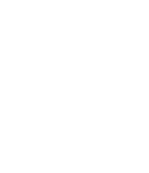

# Algoritmos sobre Números

## 1. Encontrar el Mínimo y el Máximo en un Arreglo

**Idea principal:**
Cuando queremos identificar el valor más pequeño y el más grande dentro de un conjunto de datos (lista), se puede recorrer cada elemento y comparar con los valores registrados hasta ese momento.

1. Al inicio, se toma el **primer elemento** como referencia.
2. A medida que se avanza, si encontramos un número más pequeño, lo guardamos como nuevo mínimo.
3. De la misma forma, si encontramos uno más grande, lo actualizamos como nuevo máximo.

La complejidad es **O(n)** porque se analiza cada elemento una sola vez.

**Ejemplo en código:**

```python
arreglo = [8, 3, 15, 6, 10]

minimo = maximo = arreglo[0]

for valor in arreglo:
    if valor < minimo:
        minimo = valor
    if valor > maximo:
        maximo = valor

print("Mínimo:", minimo)
print("Máximo:", maximo)
```

También se puede guardar la posición (recorriendo con índices) del mínimo y del máximo:

```python
arreglo = [8, 3, 15, 6, 10]

indice_min = indice_max = 0
for i in range(1, len(arreglo)):
    if arreglo[i] < arreglo[indice_min]:
        indice_min = i
    if arreglo[i] > arreglo[indice_max]:
        indice_max = i

print("Mínimo:", arreglo[indice_min], "en posición", indice_min)
print("Máximo:", arreglo[indice_max], "en posición", indice_max)
```

---

## 2. Sumas de Prefijos

**Idea principal:**
Calcular la suma de varios elementos seguidos en un arreglo puede ser lento si se hace desde cero cada vez.
Para optimizarlo, usamos **sumas de prefijos**:

1. Creamos un nuevo arreglo donde cada posición guarda la suma acumulada desde el inicio hasta esa posición.
2. Con esto, la suma de cualquier subarreglo se obtiene en **tiempo constante O(1)**.

Ejemplo:

* Números: `[2, 5, 3, 7]`
* Prefijos: `[2, 7, 10, 17]`

La suma desde el índice i hasta j se calcula como `prefijos[j] - prefijos[i-1]`.

Así, la suma de los elementos entre la índices 1 y 3 (`5+3+7`) es:

`prefijos[3] - prefijos[0] = 17 - 2 = 15`

**Código:**

```python
numeros = [2, 5, 3, 7]
prefijos = [0] * len(numeros)
prefijos[0] = numeros[0]

for i in range(1, len(numeros)):
    prefijos[i] = prefijos[i-1] + numeros[i]

print("Arreglo:", numeros)
print("Prefijos:", prefijos)
```

También se puede extender a **matrices** para trabajar con **submatrices**.

---

## 3. Búsqueda Binaria

**Idea principal:**
Si tenemos una lista **ordenada**, no necesitamos revisar todos los elementos para buscar un número.
Podemos:

1. Revisar el valor en la mitad.
2. Si es mayor al buscado, seguimos en la mitad izquierda.
3. Si es menor, seguimos en la derecha.

Cada paso reduce el problema a la mitad, por lo que la complejidad es **O(log n)**.

**Código iterativo:**

```python
def busqueda_binaria(arr, objetivo):
    izq, der = 0, len(arr) - 1
    while izq <= der:
        medio = (izq + der) // 2
        if arr[medio] == objetivo:
            return medio
        elif arr[medio] < objetivo:
            izq = medio + 1
        else:
            der = medio - 1
    return -1

print(busqueda_binaria([1, 3, 5, 7, 9], 7))
```

**Código recursivo:**

```python
def busqueda_binaria_rec(arr, objetivo, izq, der):
    if izq > der:
        return -1
    medio = (izq + der) // 2
    if arr[medio] == objetivo:
        return medio
    elif arr[medio] < objetivo:
        return busqueda_binaria_rec(arr, objetivo, medio + 1, der)
    else:
        return busqueda_binaria_rec(arr, objetivo, izq, medio - 1)

print(busqueda_binaria([1, 3, 5, 7, 9], 7))
```

---

## 4. Algoritmo de Euclides (Máximo Común Divisor)

**Idea principal:**
El MCD de dos números (mayor número entero que los divide sin dejar residuo alguno) se puede calcular con la siguiente propiedad:

* El MCD de `(a, b)` es el mismo que el de `(b, a % b)`.
* Se repite hasta que `b` sea 0.

Este método es mucho más rápido que probar todos los divisores.

**Código:**

```python
def mcd(a, b):
    while b != 0:
        a, b = b, a % b

    return a

print(mcd(48, 18))
```

---

## 5. Exponenciación Binaria

**Idea principal:**
Calcular `a^b` directamente con multiplicaciones puede ser muy lento si `b` es grande.
La exponenciación binaria divide el problema en 2 casos:

* Si `b` es par: `a^b = (a^(b/2))^2`.
* Si `b` es impar: `a^b = a * (a^(b-1))`.

Esto reduce la complejidad a **O(log b)**.

**Código:**

```python
def exp_binaria(a, b):
    if b == 0:
        return 1
    mitad = exp_binaria(a, b // 2)
    if b % 2 == 0:
        return mitad * mitad
    else:
        return a * mitad * mitad

print(exp_binaria(2, 14))
```

**Ejemplo:**
<div align="center">
    <p>
        
    </p>
</div>

---

## 6. Test de Primalidad O(√n)

**Idea principal:**
Un número es primo si solo es divisible por 1 y él mismo.
No es necesario probar todos los divisores hasta `n`, basta con revisar hasta `√n`.

**Código:**

```python
from math import isqrt

def es_primo(n):
    if n <= 1:
        return False
    for i in range(2, isqrt(n) + 1):
        if n % i == 0:
            return False
    return True

print(es_primo(29))
```

---

## 7. Criba de Eratóstenes

**Idea principal:**
La criba es un método muy eficiente para encontrar **todos los números primos hasta un valor `n`**.
La lógica es la siguiente:

1. Hacemos una lista con todos los números desde 2 hasta `n`.
2. Suponemos al inicio que todos son primos.
3. Tomamos el primer número de la lista (2) y eliminamos sus múltiplos, porque ya no pueden ser primos.
4. Luego pasamos al siguiente número que aún no ha sido eliminado (3) y eliminamos sus múltiplos.
5. Repetimos el proceso hasta llegar a `√n`.

Al final, los números que **no fueron eliminados** son los primos.


**Código:**

```python
from math import isqrt

def criba(n):
    es_primo = [True] * (n + 1)
    es_primo[0] = False
    es_primo[1] = False
    
    for numero in range(2, isqrt(n) + 1):
        if es_primo[numero]:
            for multiplo in range(numero * numero, n + 1, numero):
                if es_primo[multiplo]:
                    es_primo[multiplo] = False

    primos = []
    for i in range(n+1):
        if es_primo[i]:
            primos.append(i)

    return primos

print(criba(30))
```