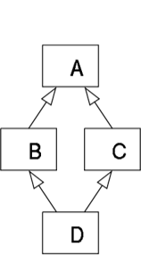

# Herencia

## Concepto
* Permite crear nuevas clases a partir de otras.
* Las clases "hijas" pueden tener todas las características de la clase "padre", solo algunas e incluso incorporar nuevas.

## Sintaxis
### Uso básico
La clase hija hereda todos los atributos y métodos de la clase padre:

**Ejemplo:**
```python
class Persona:
    def __init__(self, nombre):
        self.nombre = nombre
    def saludar(self):
        return f"Hola, soy: {self.nombre}"

class Estudiante(Persona):
    pass
```

### Sobreescribir métodos
La clase hija redefine/modifia los métodos de la clase padre:

**Ejemplo:**
```python
class Persona:
    def __init__(self, nombre):
        self.nombre = nombre
    def saludar(self):
        return f"Hola, soy: {self.nombre}"

class Estudiante(Persona):
    def saludar(self):
        return "Soy un Estudiante"
```

### Uso de ``super()``
#### Para atributos
La clase hija puede tener sus propios atributos e ``__init__``:

**Ejemplo:**
```python
class Persona:
    def __init__(self, nombre):
        self.nombre = nombre
    def saludar(self):
        return f"Hola, soy: {self.nombre}"

class Estudiante(Persona):
    def __init__(self, nombre, nota):
        super().__init__(nombre)
        self.nota = nota
```

#### Para métodos
La clase hija puede extender los métodos de la clase padre:

**Ejemplo:**
```python
class Persona:
    def __init__(self, nombre):
        self.nombre = nombre
    def saludar(self):
        return f"Hola, soy: {self.nombre}"

class Estudiante(Persona):
    def saludar(self):
        return super().saludar() + ", soy un estudiante"
```

## Herencia Múltiple
Una clase hija hereda de varias clases padre:

**Ejemplo:**
```python
class A:
    def saludar(self):
        print("Soy A")
class B:
    def saludar(self):
        print("Soy B")
class C(A, B):
    pass
```

### MRO (Method Resolution Order)
Permite entender en que orden se ejecutan los métodos heredados:

**Ejemplo:**
```python
class A:
    def saludar(self): print("Soy A")
class B(A): 
    def saludar(self): print("Soy B")
class C(A): 
    def saludar(self): print("Soy C")
class D(B, C):
    pass

print(D.__mro__)
```

<div align="center">
    <p>
        
    </p>
</div>

> [!NOTA]
> También podemos utilizar super() para coordinar la ejecución, lo que hace es ejecutar lo que se encuentra en un nivel superior según el MRO: D -> B -> C -> A